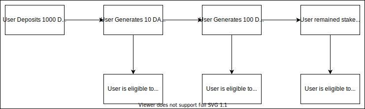

# GAAVE

## Problem Statement

There is not enough philanthropy in the world due to the lack of engagement towards donors.

## Solution

A platform where crypto users could deposit their cryptocurrencies to generate yield for a cause. To further drive engagement, soulbound NFTs would be available for claim whenever a user reaches certain milestone when generating yield for a cause.

## Core Features

### Donors

- Stake cryptocurrencies to generate yield for charity.
- Claim NFTs based on yield milestones.
- Unstake cryptocurrencies whenever
- Claim yield from AAVE's borrowing/lending protocol on behalf of GAAVE

### Fundraisers

- Create Campaigns
- Receive Donations from Donors

### DAO

- Vote on Fundraising Campaign
- View Proposed Campaigns
- View Current Campaign progress

## Technical Architecture

## Sponsor Technologies

This project would not have been possible without these wonderful underlying technology:

- Polygon
- IPFS
- AAVE
- The Graph
